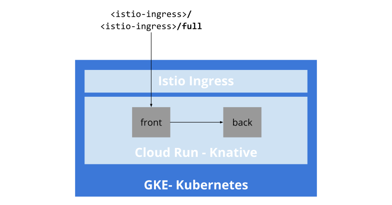

# From GKE to Cloud Run, a journey

This is a repo with the code and demo steps I've used for the [bk8s 2020 (Balearic Kubernetes Day)](https://www.meetup.com/awsusergrouppalma/events/273766784/). What's documented here works, but it assumens some basic knowledge of GCP, KNative, Cloud Run, Cloud Build and related technologies.

## Prerequirements

You'll need:

- access to Google Cloud Platform with billing enabled (for this, the 300USD free credit are more than enough)
- the Google Cloud SDK installed in your local machine.
- a configuration to work with gcloud (`gcloud config configurations...`), or the equivalent setup.
- the necessary Google Cloud APIs enabled (if not, the gcloud command will be prompting you to do so).
- the KNative command line tool, `kn`.
- A minimum knowledge of the command line tool.
- Visual Studio Code if you want to follow the Cloud Run deployment from the IDE step further down the doc.

This document assumes your're on Mac OS X, however I'm using UNIX POSIX power tools when possible which means it should work without major changes in Linux.

## Some background

This repo contains two services, intented to talk to each other. They are:
- frontend service, *front*, materialized `front/main.py`, a Flask app that accepts two commands:
   - `<service>/`: returns the version of the service, exposed through the service variable `TARGET`.
   - `<service>/full`: Invokes the backend service and returns the version of both services, exposed through the service variable `TARGET` in each of them. For it to work, it expects to get the upstream URL of the backend service *back* in a variable called `BACKEND_URL`that the code is considering.

Both services *front* and *back* are available outside the cluster at the beginning. The first deployment we'll do will use Cloud Run deployed on top a Kubernetes GKE cluster:



Next, we'll change accessibility of the services and play with the revisions and traffic, as well as redeploying in the managed version of Cloud Run.

## Initial setup

Activate a configuration with your project. In my case, it is called *gcprocks*:
```bash
gcloud config configurations activate gcprocks
```

Let's first create a GKE cluster with Cloud Run enabled that will allow us to deploy KNative services:
```bash
export CLUSTER_NAME="bk8s"
export ZONE="europe-west1-b"
time gcloud container clusters create "${CLUSTER_NAME}"\
    --release-channel=rapid \
    --addons=HttpLoadBalancing,CloudRun \
    --machine-type=n1-standard-4 \
    --enable-stackdriver-kubernetes \
    --zone "${ZONE}"
```

While the cluster is being created, let's quickly review the application, and create and upload to Cloud Repositories both services images.

Starting with the back service image:
```bash
cd back/
gcloud builds submit -t gcr.io/javiercm-gcprocks/back .
```

and then the front service image:
```bash
cd ../front
gcloud builds submit -t gcr.io/javiercm-gcprocks/front .
```

Now that the cluster has been created, you should see that the credentials have been transferred to the `kubectl` tool:
```bash
kubectx
```

## Deploying on GKE

We're not going to discuss deploying objects on GKE today. You know what it takes, but let's review quickly what it involves.

- Navigate the k8s folder in the backend service.
- Show the deployment.yaml and the service.yaml.
- Clearly, you need to understand Kubernetes constructs.
- Quickly discuss how we should also manage these objects as configuration as data.
- To implement and control traffic patterns you would need to deploy and operate a Service Mesh.

## Deploying on Cloud Run for Anthos on GKE

### Setting up the environment

Let's move now to deploying our services as KNative services. First, let's tell `gcloud` that we want to point Cloud Run to a GKE cluster:
```bash
gcloud config set run/platform gke
gcloud config set run/cluster "${CLUSTER_NAME}"
```

Then, create a namespace for Cloud Run and set it in the `gcloud` configuration:
```bash
kubectl create namespace javiercm-gcprocks
gcloud config set run/namespace javiercm-gcprocks
```

Check that everything is in place, you should see `gke` being used as Cloud Run platform, the namespace just configured, and the name of the cluster:
```bash
gcloud config configurations describe gcprocks
```

We deployed a KNative-enabled cluster via Cloud Run in the previous section, let's check that:
```bash
kubectl get namespace knative-serving -o 'go-template={{index .metadata.labels "serving.knative.dev/release"}}'; echo ""
```

We can see we've got the pods materializing the different KNative Serving components in the `knative-serving` namespace:
```bash
kubectl get pods -n knative-serving
```

Now, go to the [Google Cloud Console](https://console.cloud.google.com) for your project and follow these steps:

- Select Kubernetes Engine in the right menu
- Select Services & Ingress
- Look for the **istio-ingress** External Load Balancer type in the list.

This entry will have the external IP that's the entry point for Cloud Run in our cluster. We'll be capturing it via command line in the next steps.

### Deploying the backend service

Now, let's deploy both services from the images we just uploaded to Container Registry. Let's start first with the backend service:
```bash
gcloud run deploy back --image gcr.io/javiercm-gcprocks/back --set-env-vars TARGET="v1"
```

Note the service URL, ending in the default KNative domain `example.com` that is returned to you. You'll have to use this URL in the header of your request if you want it to reach the right service in the Kubernetes cluster.

Now, let's get the entrypoint IP to test our service that we just saw in the console:
```bash
EXTERNAL_IP=$(kubectl get service istio-ingress --namespace gke-system -o=jsonpath='{$.status.loadBalancer.ingress[0].ip}' | tee /dev/tty); echo ""
```

We have all we need. Let's try to access the *back* service:
```bash
curl -H 'Content-Type: text/plain' \
   -H 'Host: back.javiercm-gcprocks.example.com' \
   "${EXTERNAL_IP}"
```

> Note: if you want to use domain names instead of IPs and host headers, see [Changing GKE default domain to one usable for testing](https://cloud.google.com/run/docs/gke/default-domain)

You should see something like:
```text
Hello from frontend v1
```

### Deploying the frontend service

Let's follow the same steps with the frontend service. First, deploy it in the cluster, noting that this service requires that we pass an environment variable with the URL where we can locate the back service:
```bash
BACKEND_URL="http://back.javiercm-gcprocks.svc.cluster.local"
gcloud run deploy front --image gcr.io/javiercm-gcprocks/front --set-env-vars TARGET="v1",BACKEND_URL="${BACKEND_URL}"
```

Here, the `BACKEND_URL` variable contains a cluster-local FQDN. This is because we're going to access the service directly using the cluster internal naming resolution.
Note the service URL, ending in the default KNative domain `example.com`. 

Let's try first the front service by itself:
```bash
curl -H 'Content-Type: text/plain' \
   -H 'Host: front.javiercm-gcprocks.example.com' \
   "${EXTERNAL_IP}"
```

and then let's try the front service integrated with the backend:
```bash
curl -H 'Content-Type: text/plain' \
   -H 'Host: front.javiercm-gcprocks.example.com' \
   "${EXTERNAL_IP}/full"
```

### Restricting the backend service to the local cluster

As you can see, we're using as backend URL the internal cluster routing instead of the public service endpoint. This is useful in case the backend service has been deployed so it's not publicly accessible. Let's do that through the console:
- Go to Cloud Run
- Select the **back** service
- Select the **TRIGGERS** tab on top
- Change **HTTP Connectivity** from External to Internal

Now, let's try again invoking the back service and then the back service through the front. We should see that only the front can get back the information from the back:

```bash
curl -H 'Content-Type: text/plain' \
   -H 'Host: back.javiercm-gcprocks.example.com' \
   "${EXTERNAL_IP}"
```

We should get no answer fron the backend service now. Try again through the front end service:

```bash
curl -H 'Content-Type: text/plain' \
   -H 'Host: front.javiercm-gcprocks.example.com' \
   "${EXTERNAL_IP}/full"
```

### Exploring the Knative interfaces

Remember, we've been using KNative the whole time, we can see it using the `kubectl` equivalent for the KNative world, the `kn` command:

```bash
kn service list -n javiercm-gcprocks
```

### Managing revisions the Knative way

We could even create a version 2 of the service using a KNative yaml file. Inspect the file `front-v2.yaml` in the `front/knative` folder and then deploy it:
```bash
cd front/knative
kubectl apply -f front-v2.yaml
```
Go to the console and check in Cloud Run how the service is there.

Inspect the `service-v2v3-split.yaml` file. You should see that it's defining the deployment of a service version 3 and configuring traffic splitting in the Knative way:
```bash
cd front/knative
kubectl apply -f front-v2v3-split.yaml
```

Let's check how the traffic for the frontend behaves:
```bash
for i in {1..10}; do curl -H 'Content-Type: text/plain' -H 'Host: front.javiercm-gcprocks.example.com' "${EXTERNAL_IP}"; sleep 1; done
```

Finally, let's go to the console and modify the traffic in an easy way

- Go to Cloud Run
- Select the **REVISIONS** tab
- Selelect the **MANAGE TRAFFIC** option
- Put a 100% on the latest version v3, tagged as "candidate"

We should go further, using workload identities to identify both front and back services so that only whitelisted identities can consume this backend service, and not anyone in the cluster network. In the interest of time, we'll do this though for Cloud Run Managed, so let's move there.

## Deploying on Cloud Run

Cloud Run Managed exposes services endpoints publicly. But that doesn't mean the services are unprotected. One of the ways to make a service *internal* to the platform is disabling unauthenticated connections. Now our services will be using services accounts as identities and we'll leverage them to authenticate services to each other

### Pointing `gcloud` to the managed Cloud Run platform

We're leaving the Kubernetes Operation world now. To do it, the only tooling change we need to do in our tooling is to point `gcloud` to Cloud Run managed:
```bash
gcloud config set run/platform managed
```

### Creating services identities

Let's create the service accounts that we'll be using to identify our services:

```bash
gcloud iam service-accounts create front-identity
gcloud iam service-accounts create back-identity
```

We'll be assigning these identities to the services at service deployment time.

### Deploying the backend service.

We'll be deploying the backend service to Cloud Run managed. We could be reusing the container image we already created, but instead, let's use our integration with Cloud Code. Let's move to the folder with the new front service using authentication and fire up Visual Studio Code with the Cloud Code plugin enabled. Select Cloud Run in the left menu, and follow these guidelines to create a new service from VSCode:

- Create a service
- Service Name: back
- Deployment Platform: Cloud Run, fully managed
- Require authentication
- Container image URL: gcr.io/javiercm-gcprocks/back
- Service account URL: back-identity@javiercm-gcprocks.iam.gserviceaccount.com
- Docker: simple-service/back/Dockerfile

Click **Deploy**. Unfortunately, for this release of Cloud Code, you need the local Docker daemon running and cannot use Cloud Build just yet.

### Deploying a front service using new code

We need now to build and deploy the new version of the front service. This new service uses OAuth2 to authenticate against the backend service presenting its associated service account as identity.

We're just passing the default credentials available to the Cloud Run runtime when we do this. To know more, have a look at the files **`front-auth/main.py`** and **`front-auth/back.py`**

Let's first build our new image:
```bash
cd ../../front-auth
gcloud builds submit -t gcr.io/javiercm-gcprocks/front:v1 .
```

and capture the back service URL just exposed:
```bash
BACKEND_URL=$(gcloud run services describe back | grep Traffic | cut -d " " -f2 | tee /dev/tty)
```

Finally, deploy the service into Cloud Run managed:

```bash
cd ../front-auth
gcloud run deploy front --image gcr.io/javiercm-gcprocks/front:v1 \
  --service-account front-identity \
  --set-env-vars TARGET="v4",BACKEND_URL="${BACKEND_URL}" \
  --allow-unauthenticated
```
### Setting up policy

To finish our configuration, we now need to tell Cloud Run to allow the back service to be called from the front, and only the front:
```bash
gcloud run services add-iam-policy-binding back \
  --member serviceAccount:front-identity@javiercm-gcprocks.iam.gserviceaccount.com \
  --role roles/run.invoker
```

### Testing the setup

Finally, test first the back service to see we're not authorised:

```bash
echo "${BACKEND_URL}" | pbcopy
```

Open a browser tab and paste the clipboard contents. The backend service shouldn't be accessible.

To test that the front service can access the back service, copy the frontend service URL into your clipboard:
```bash
FRONTEND_URL=$(gcloud run services describe front | grep Traffic | cut -d " " -f2 | pbcopy)
```

paste it into a new browser tab, and add the **`/full`** at the end of the service URL. Note that here, we're always using the FQDN for the services, and not internal cluster addresses.
